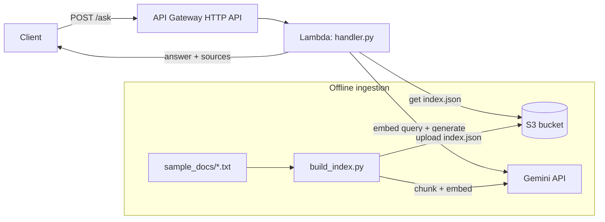
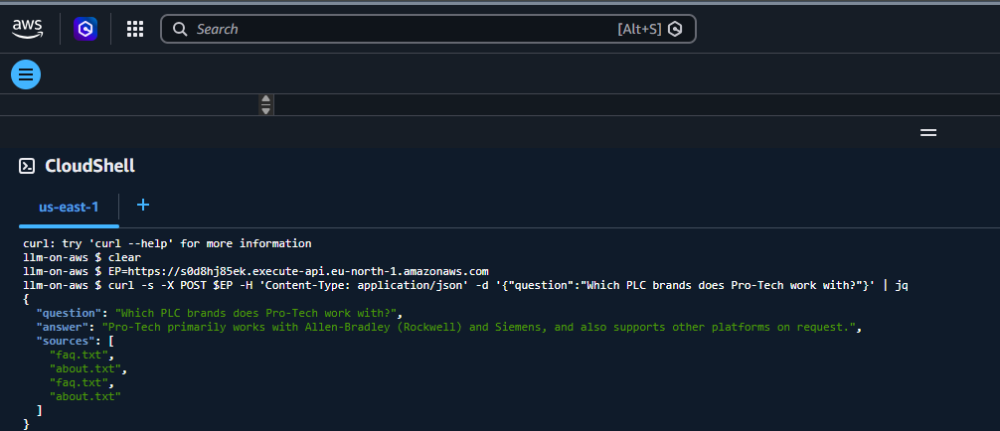
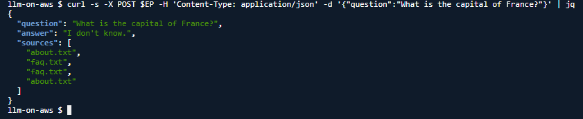

# llm-on-aws

A retrieval-augmented question-answering API deployed on AWS. You POST a
question, the service finds the most relevant chunks from a knowledge base
stored in S3, and a language model answers using only that context.

It is a small, working example of the full path a real ML feature takes:
data ingestion, embedding, retrieval, generation, and deployment behind an
HTTP endpoint, running inside the AWS free tier.

## Architecture



- **API Gateway (HTTP API)** exposes a single `POST /ask` route.
- **Lambda** loads the embedding index from S3, embeds the question, ranks
  chunks by cosine similarity, and asks the model to answer from the top
  matches. It caches the index on the warm container.
- **S3** holds `index.json` (text chunks plus their embedding vectors).
- **Gemini** provides embeddings (`text-embedding-004`) and generation
  (`gemini-2.5-flash`), called over plain HTTPS so the Lambda has no
  third-party dependencies to package.

## Live demo

Deployed and tested on AWS (Lambda + API Gateway + S3, region `eu-north-1`).

A grounded answer pulled from the knowledge base:



And the same endpoint declining a question the documents do not cover, instead
of making something up. The retrieval-plus-grounding design is what keeps it
honest:



## What this demonstrates

| Area | Where |
| --- | --- |
| Full ML workflow, ingestion to deployment | `ingest/build_index.py` + `app/handler.py` |
| AWS infrastructure (Lambda, S3, API Gateway) | `infra/template.yaml`, `deploy.ps1` |
| Vector search, embeddings, semantic retrieval | cosine ranking in `handler.py` |
| Modern LLMs | Gemini embeddings + generation |
| API-based model serving / microservice | the `POST /ask` endpoint |
| Scalability and maintainability | stateless Lambda, cached index, zero-dependency package |

## Setup

1. Get a Gemini API key from Google AI Studio.
2. Copy `.env.example` to `.env` and fill in `GEMINI_API_KEY`.
3. (Optional) replace the files in `sample_docs/` with your own `.txt` content.

## Deploy

### Option A — SAM (recommended)

```bash
pip install aws-sam-cli
sam build -t infra/template.yaml
sam deploy --guided \
  --parameter-overrides GeminiApiKey=$GEMINI_API_KEY IndexBucketName=<your-unique-bucket>
```

Then build and upload the index:

```bash
python ingest/build_index.py --upload --bucket <your-unique-bucket> --key index.json
```

### Option B — plain AWS CLI (no SAM)

Edit the three values at the top of `deploy.ps1`, then:

```powershell
powershell -ExecutionPolicy Bypass -File .\deploy.ps1
```

The script creates the bucket, IAM role, Lambda, and HTTP API, then builds
and uploads the index. It prints the endpoint URL at the end.

## Test

```bash
curl -X POST <api-url>/ask \
  -H "Content-Type: application/json" \
  -d '{"question": "Which PLC brands does Pro-Tech work with?"}'
```

Response:

```json
{
  "question": "Which PLC brands does Pro-Tech work with?",
  "answer": "Primarily Allen-Bradley (Rockwell) and Siemens ...",
  "sources": ["faq.txt"]
}
```

## Cost

Designed to run at ~zero cost. The model runs on Google's API, not on AWS, so
the AWS side uses only Lambda, API Gateway, and S3:

- Lambda: 1M requests/month always free
- API Gateway HTTP API: 1M calls/month (first 12 months)
- S3: 5 GB (first 12 months)

Gemini calls use your own key and the index here is tiny, so embedding and
generation cost is negligible.

## Design notes

- **No dependencies in the Lambda.** Gemini is called over `urllib`, retrieval
  is pure-Python cosine similarity, and `boto3` ships in the runtime. The deploy
  is a single zip of `handler.py` with no native-wheel packaging.
- **Index cached per container.** The index loads from S3 once and is reused
  across warm invocations.
- **Grounded answers.** The prompt instructs the model to answer only from the
  retrieved context and to say when it does not know, which reduces made-up
  answers.

## Repo layout

```
app/handler.py          Lambda function (RAG query handler)
ingest/build_index.py   local: chunk docs, embed, upload index.json to S3
infra/template.yaml     SAM template (Lambda + API Gateway + S3)
infra/trust-policy.json IAM trust policy for the manual deploy
deploy.ps1              plain AWS CLI deploy (no SAM)
sample_docs/            example knowledge base
```
